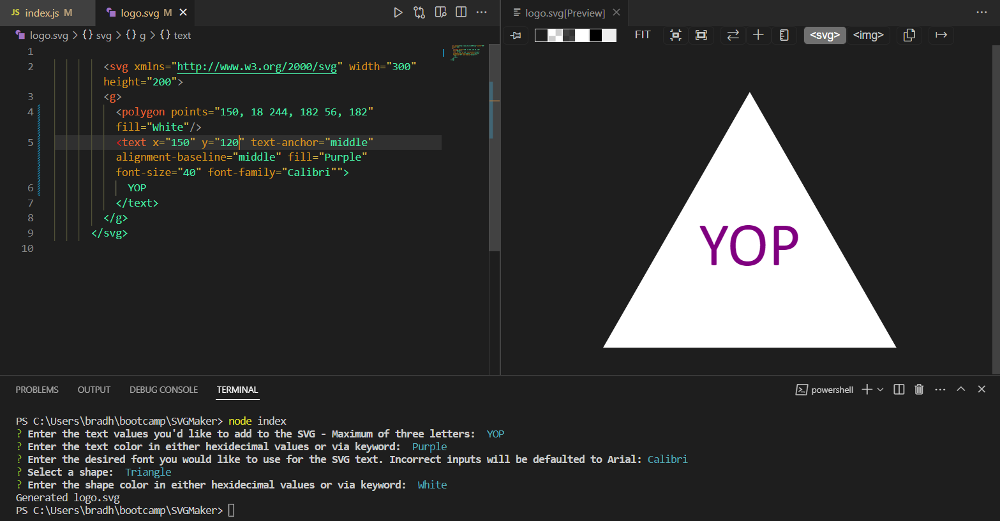
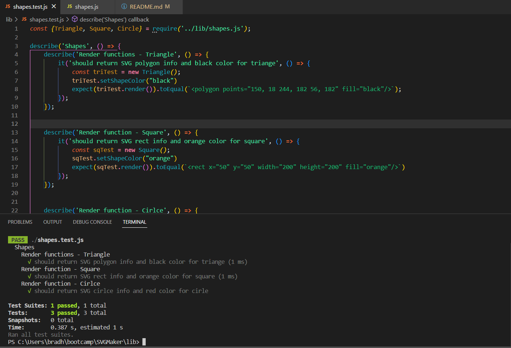

# SVG Generator

In this project, we were asked to design a program capable of outputting an SVG file, given user inputs collected with inquirer. Scalable Vector Graphics are web-friendly file format images which can be scaled to relatively any size. Using the program, users can automatically generate the file contents for the SVG without needing to hard code them directly. Provided is the Acceptance Criteria and subsequent implementations that seek to solve the problems commonly presented with SVG creation:

GIVEN a command-line application that accepts user input
WHEN I am prompted for text
THEN I can enter up to three characters and issued an error when the submitted amount is greater than three.
WHEN I am prompted for the text color
THEN I can enter a color keyword (OR a hexadecimal number).
WHEN I am prompted for a shape
THEN I am presented with a list of shapes to choose from: Triangle, Square and Circle. All of which are organized into a seperate shapes.js file for readabiltiy and accessability. They also all fall under the Shapes parent class to prevent redundancy with setting up the assignments for shape color values.
WHEN I am prompted for the shape's color
THEN I can enter a color keyword (OR a hexadecimal number)
WHEN I have entered input for all the prompts
THEN an SVG file is created named `logo.svg`, which can be easily exported to a project of my choice.
AND the output text "Generated logo.svg" is printed in the command line, confirming that the SVG has been created.
WHEN I open the `logo.svg` file in a browser
THEN I am shown a 300x200 pixel image that matches the criteria I entered.

Inquirer prompts allow us to collect the desired shape, text and color of each before writing them to the new SVG file. Organizing and exporting the classes for the shapes seperately allows for better readability without sacrificing performance. Finally, test files using jest confirm the shapeColorVal() functions are working correctly for appending the color information directly into the shape, befor ethe render() function is ran to generate the SVG code.

My biggest challenge over the course of the project was utilizing inheritance between the Shape and subclasses of Triangle, Square and Circle to properly render the shapes color using string literals. Consulting with MDN docs, and utilizing .this statements, the solution was paired with an enriched understanding of the role inheritance plays in Object-Oriented programming.

Video of *index.js* functionality: https://drive.google.com/file/d/1s-fe5yQgcVUOuhYSuznG6Sb2lh0vmmZl/view
Video of *shapes.jest.js* testing: https://drive.google.com/file/d/1y6O2-pcK0O1s4lfDTEhj6q-Tw61vGPJ3/view 

## Table of Contents 

-[Technologies Used](#technologies-used)
-[Installation](#installation)
-[Usage](#usage)
-[Tests](#tests)
-[Contribution](Contribution)
-[Questions?](#questions?)

## Technologies Used

JavaScript
VSCode
Terminal 
Node.js v16
Inquirer NPM Package
NPM / NPX
SVG
Github.com
GitBash
SVG Preview VSCode Extension

## Installation 

Before you can run the SVG Generator, the package dependencies must be installed using npm i which will automatically install inquirer and jest to a package.json file. (This is if you didn't already install the packages directly from Github). This requires you to have npm installed, which usually comes with Node.js installation. From there, you'll want to enter *node index.js* to run the program locally. Follow each of the prompts, which will instruct you to enter the following information: Desired shape, desired text and the colors for both. From there, the information will be appended to a `logo.SVG` file, which you can export or copy for your own personal use. 

Suggested: Download the SVG Preview extension if using VSCode. Otherwise, you can view the SVG file locally in your browser.

# Usage 

When the program starts using *node index.js*, you'll follow the prompts to provide all information for the SVG Generation. A statement will be printed off when your information has been written to the logo.SVG file. To preview in broswer, you can right click the file within the explorer viewbox and select "Open With" and select the program of your prefered choice. To export, you can "Save As" a new file elsewhere in your local device or drag to a different folder using your programs directory/file organizer. 

For tests, you can run *npx jest* to test the capabilities of the program, with all test statements being located within the `shapes.test.js` file inside of the lib folder. There you will also find the `shapes.js` file, which is exported into the `index.js` to utilize the class properties of Shapes.

# Tests

For the jest file, three tests were set up to ensure the Shapes functioned as intended:

- Individual render() functions for each shapes return the correct SVG string to be appended to the logo.SVG file in the program.
- Colors assgined to the shapes using the Shapes parent class method .setShapeColor work correctly.

Included are pictures of the successful tests. Videos of the tests are submitted in the description:

# Contribution

If you'd like to contribute to the project, you can make a PR via GitHub explaining your additions to the codebase. As it stands, tests for the text and text color would be much appreciated. Supplementary additions of more shapes/templates would also be greatly benificial.

GitHub Repo: https://github.com/BradHamm/SVGGenerator

# Questions?

If you have any further questions on the project, or my workflow in completing the assignment, feel free to each out to me via email and I'll respond as soon as possible. Also, check out my Github for projects similar to the SVG Generator - Like my R*EADME Generator* and *Brewster: Beer Me!* Project

*Github*: https://github.com/BradHamm
*Email*: bradham.opt@gmail.com

